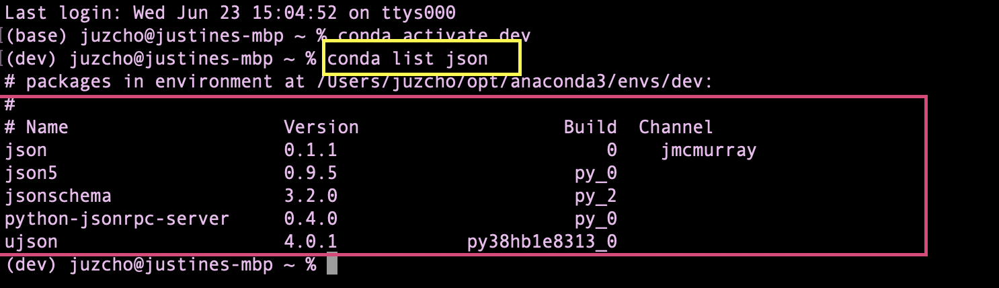
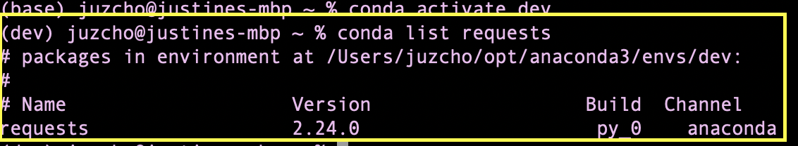

# **Financial Planning Tool**

## Overview

The Financial Planning Tool project is about understanding and evaluating the financial health of a credit union. It should help them decide how to plan their budgets and retirement plan.

---

## Technologies

This project leverages **[python version 3.8.5](https://www.python.org/downloads/)** with the following packages and modules:

* [pandas](https://pandas.pydata.org/docs/) - This was used to be able to easily manipulate dataframes.

* [Jupyter Lab](https://jupyterlab.readthedocs.io/en/stable/) - This was used to be able to create and share documents that contain live code, equations, visualizations and narrative text.

* [numpy](https://numpy.org/install/) - This was used in calculating a square root of one of the arrays we have on the iPython notebook.

* [matplotlib inline](https://github.com/ipython/matplotlib-inline) - This is used on the iPython Notebook. It allows us to add plots to the browser interface.

* [JSON](https://docs.python.org/3/library/json.html) - This is used to convert the python dictionary from the API into a JSON string that can be written into a file.

* [ALPACA TRADE API](https://alpaca.markets/docs/) -  This is used to get API trading data for this project. To have access to Alpaca's API key and API secret keys, the user needs to register for personal account and save their own keys.

* [Monte Carlo Simulation](https://github.com/PythonProgramming/Monte-Carlo-Simulator) - This was used to generate range of possible outcomes on our portfolio.

* [conda Requests library](https://anaconda.org/anaconda/requests) - This is used as a standard for making HTTP requests in Python.

* [OS module](https://docs.python.org/3/library/os.html) - This provides a portable way of using operating system dependent functionality.

* [python-dotenv Library](https://pypi.org/project/python-dotenv/) - This enables the user to read key-value pairs from an .env file and set them as an environment variables.

---

## Installation Guide

### 1. Installing and Running Jupyter notebook

On the terminal, under the conda dev environment, type the code below:

`pip install jupyterlab`

#### * Opening Jupyter notebook

If you have Jupyter Lab already installed, to open your Notebook and be able to view your hidden files, please type this while on your conda dev environment:

`jupyter lab --ContentsManager.allow_hidden=True` 

Once you click ENTER, this will open on your default browser.

---

### 2. Installing JSON

Check if you already have JSON on your conda dev environment, by typing:

`conda list json`

- If you have JSON installed you should see the version.

 

- To install the JSON library, check that your development environment is active, and then run the following command:

`conda install -c jmcmurray json`

---

### 3. Installing Request Library

Check if you already have JSON on your conda dev environment, by typing:

`conda list requests`

- If you have request library is installed, then you should see the version.

 

- To install the Requests library, check that your development environment is active, and then run the following command:

`conda install -c anaconda requests`

---
### 4. Install python-dotenv library

- To install this library, run the following command in your terminal:

`pip install python-dotenv`

---
### 5. Install the Alpaca SDK

- To install this SDK, run the following command in your terminal:

`pip install alpaca-trade-api`

---

### 6. To verify the installations of dotenv and Alpaca API:

`pip list | grep -E "python-dotenv|alpaca-trade-api"`

---

## Contributors

Contributed by: Justine Cho

Email: chojustine0@gmail.com

[ LinkedIn](https://www.linkedin.com/in/justinecho)

